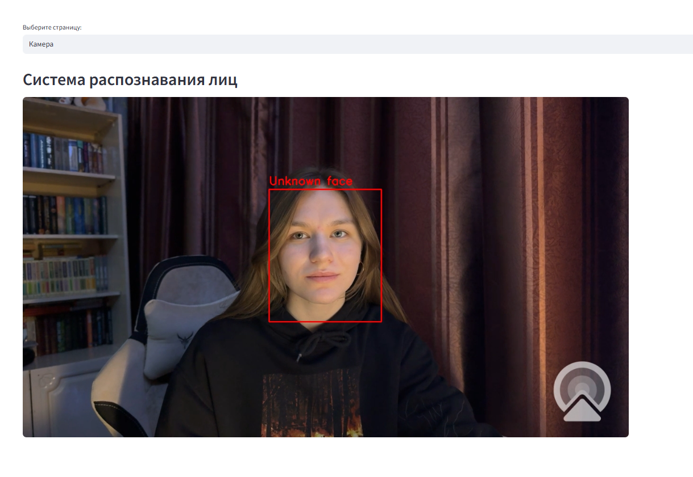
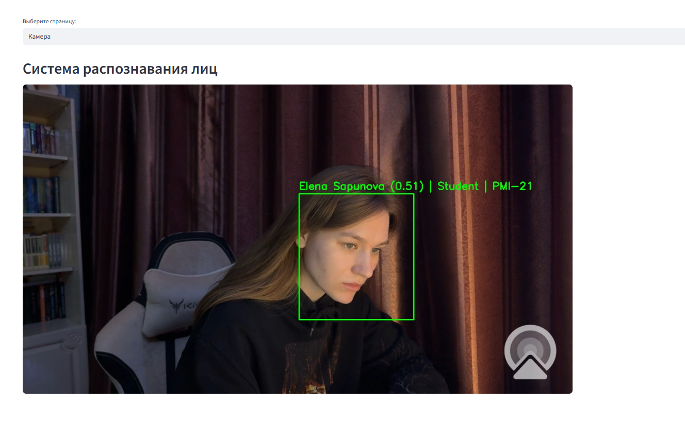
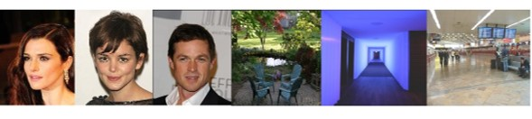
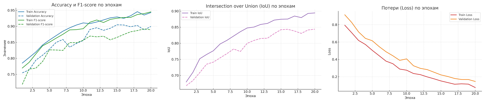

# Распознавание лиц с использованием PyTorch и FaceNet

Проект предназначен для автоматического распознавания лиц и добавления новых пользователей в базу.  

Реализован с использованием **PyTorch**, **facenet-pytorch**, **OpenCV** и **Streamlit**.  
Система умеет:
- Обнаруживать лица на фото и в видео (с камеры)
- Извлекать векторные представления (эмбеддинги) лиц
- Находить наиболее похожие лица в базе
- Добавлять новых пользователей в базу

## Пример работы





## Основные компоненты

- **Face Detection** — кастомная модель `FaceDetectionModel` на основе MobileNetV3, дообученная для задач классификации и регрессии.  
- **Face Embedding** — `FaceNet` (InceptionResnetV1).  
- **Хранение данных** — SQLite.  
- **Интерфейс** — Streamlit.

## Детекция

**Данные:** CelebA + Places205



**Функция потерь:** total loss = regression loss × 5 + classification loss × 0.3

- Regression Loss — Generalized IoU Loss (GIoU)  
- Classification Loss — Binary Cross Entropy (BCE)



## Как запустить

1. Установите зависимости:
```bash
pip install -r requirements.txt
```

2. Запустите веб-интерфейс:
```bash
streamlit run app.py
```

3. Добавьте пользователя в базу: 

**Вариант A — через интерфейс Streamlit**
- Перейдите на вкладку **«Добавить пользователя»**.
- Укажите имя и загрузите одно фото.
- Система обработает изображение, извлечёт эмбеддинг и сохранит его в базе.

**Вариант B — программно**
- При желании вы можете написать собственную функцию для добавления пользователей напрямую в базу.
- Используйте готовые функции проекта для детекции лиц и получения эмбеддингов.
- Сохраните полученные векторы в SQLite в формате, который используется проектом.

## Дальнейшие планы

На данный момент из-за кастомной архитектуры выполняется только single-detection.  
Планируется:
- Добавить поддержку распознавания нескольких лиц.
- Улучшить детекцию в сложных условиях (низкое качество, поворот головы).
- Перейти на современные модели детекции лиц (RetinaFace, MTCNN, BlazeFace).

